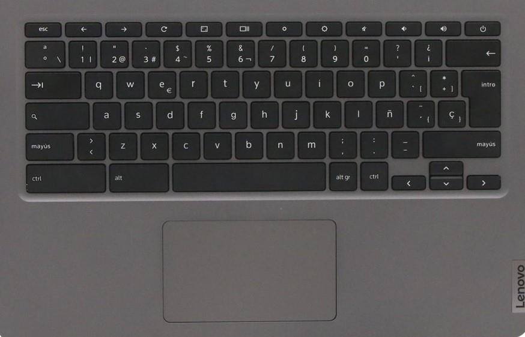
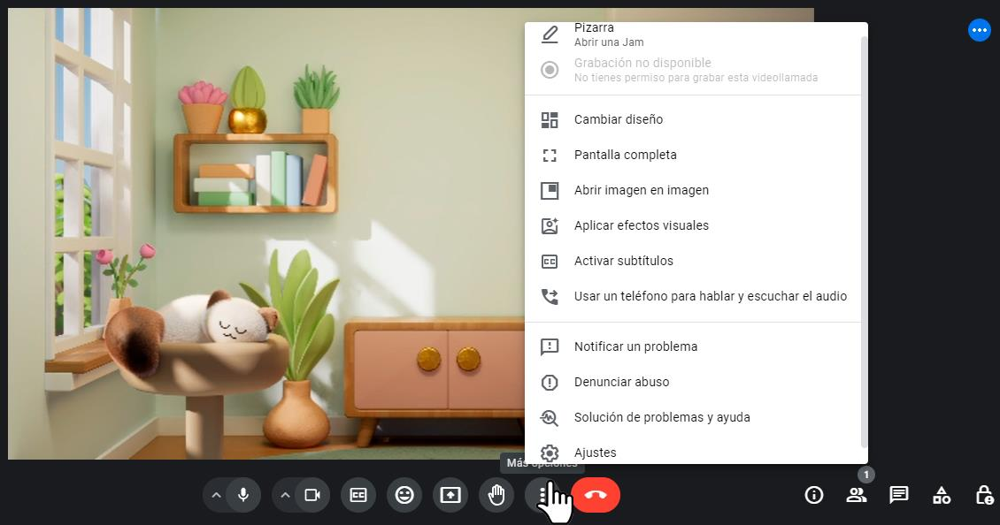
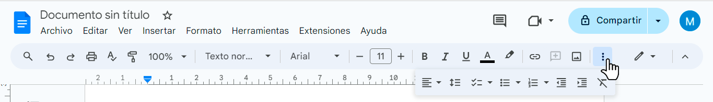
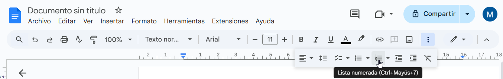
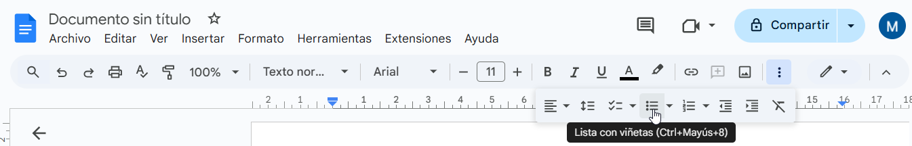
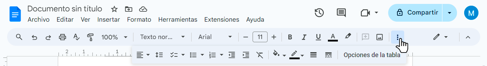
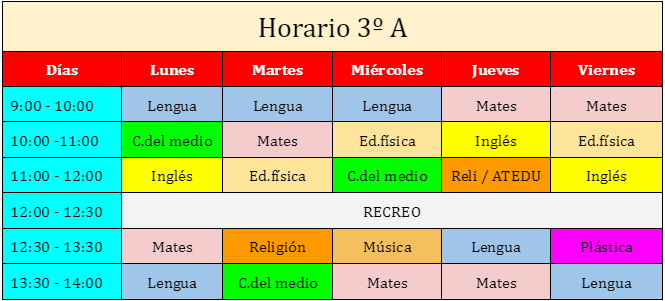
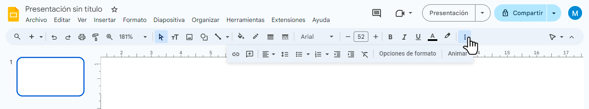
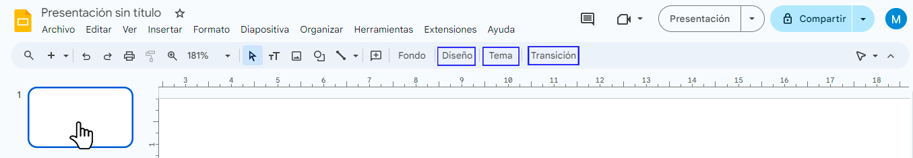
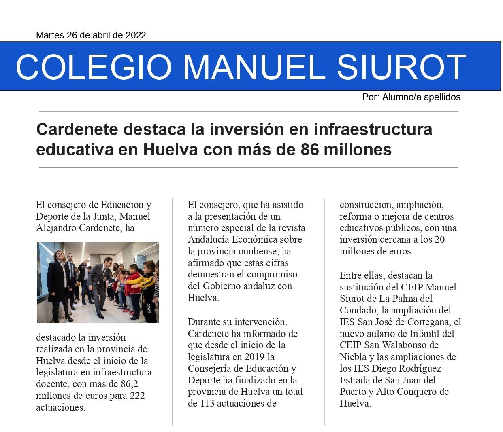

> CURSO DE CAPACITACIÓN DEL ALUMNADO EN HERRAMIENTAS BÁSICAS DE GOOGLE
> DRIVE.
>
> CEIP Manuel Siurot
>
> <u>Contenido</u>
>
> Sesión 1: Documentos de Google y Caracteres del
> Teclado......................................................2 Sesión
> 2: Google
> Classroom......................................................................................................4
> Sesión 3:
> Gmail..........................................................................................................................5
> Sesión 4: Google Meet
> ..............................................................................................................6
> Sesión 5: Documentos de Google - Formato
> básico..................................................................7
> Sesión 6: Documentos de Google - Imágenes y
> listas...............................................................8
> Sesión 7: Documentos de Google - Tablas
> ................................................................................9
> Sesión 8: Documentos de Google - Diseño de
> página.............................................................10
> Sesión 9: Presentaciones de Google
> .......................................................................................11
> Sesión Final: Documentos de Google – La
> noticia...................................................................13
>
> **Nota:** **Antes** **de** **comenzar** **cada** **práctica,** **el**
> **docente** **encargado** **realizará** **el** **tutorial** **en**
> **la** **pizarra** **digital** **con** **el** **fin** **de**
> **resolver** **posibles** **dudas.** **El** **alumnado** **podrá**
> **tener** **las** **instrucciones** **delante** **como** **guía**
> **para** **hacer** **la** **actividad.**
>
> 1

> <u>Sesión 1: Documentos de Google y Caracteres del Teclado</u>
>
> **Objetivo**: Aprender a abrir un documento de Google y usar
> caracteres especiales del teclado. Además, practicaremos atajos de
> teclado básicos.
>
> **Tutorial** **en** **la** **pizarra** **digital**:
>
> El docente enseñará al alumnado a realizar las siguientes acciones:
>
> 1<u>. Abrir Documentos de Google</u>:
>
> • Inicia sesión en tu cuenta de Google.
>
> • Abre <u>Google Drive</u> y haz clic en "Nuevo" -\> "Documentos de
> Google".
>
> 2\. <u>Caracteres Especiales del Teclado</u>:
>
> **IMPORTANTE**: la tecla de mayúsculas (Shift) activa los caracteres
> situados en la parte superior de algunas teclas.
>
> • Tildes: á, é, í, ó, ú (tecla de la tilde + tecla de la vocal). •
> Diéresis: (Tecla mayúsculas + tecla de tilde¨).
>
> • Dos puntos: (Tecla mayúsculas + :).
>
> • Punto y coma (Tecla mayúsculas + ;).
>
> • Signos de exclamación: (Tecla mayúsculas + ¡), ! (Shift + !).
>
> • Signos de interrogación: ¿ (Tecla mayúsculas + ¿), ? (Tecla
> mayúsculas + ?). • Paréntesis: ( ), (Tecla mayúsculas + paréntesis).
>
> • Símbolo del euro: € (AltGr + E).
>
> • Mayúsculas: Tecla mayúsculas + letra. • Comillas: (Tecla
> mayúsculas + ").
>
> • Tecla "Intro" para cambiar de párrafo e ir al siguiente renglón
> (Recordar que el renglón baja automáticamente si estamos en el mismo
> párrafo).
>
> **Recuerda:** **los** **signos** **de** **puntuación** **(coma,**
> **punto,** **interrogación,** **paréntesis,** **etc.)** **van**
> **unidos** **a** **la** **palabra** **y** **luego** **pulsamos**
> **la** **tecla** **de** **espacio.**
>
> 2
>
> **3.** **Comandos** **de** **Teclado:** • Ctrl + C: Copiar.
>
> •     Ctrl + V: Pegar. •     Ctrl + X: Cortar.
>
> • Ctrl + Z: Deshacer.
>
> • Ctrl + A: Seleccionar todo en documentos de Google. (En Word y
> LibreOfice es Ctrl + E).
>
> **Actividad** **Final**:
>
> Escribe el siguiente párrafo en un documento de Google, utilizando
> todos los caracteres y comandos aprendidos:
>
> María ganó un billete de 20 € en un concurso. ¡Qué suerte! ¿En qué
> podría gastarlo? Decidió ir al súper “MaxiSur” para hacer la compra.
> Esto fue lo que adquirió: azúcar, limón (verdes y maduros) y dos kilos
> de plátanos; también compró algunos productos de limpieza.
>
> Luego llegó a casa y preparó una rica macedonia de frutas. Estaba
> riquísima. Todos la felicitaron y María se puso roja porque le daba
> vergüenza.
>
> 3
>
> <u>Sesión 2: Google Classroom</u>
>
> **Objetivo**: Aprender a usar la interfaz de Google Classroom y
> entregar una tarea.
>
> **Tutorial**: (El docente podrá usar una cuenta de alumnado para
> mostrar la interfaz de la pizarra digital)
>
> 1\. Accede a <u>Google Classroom</u> con tu cuenta escolar.
>
> 2\. Busca la clase y la tarea asignada en "<u>Trabajo de clase"</u>.
>
> 3\. <u>Descarga una imagen de internet</u>: busca una imagen y haz
> clic en ella. Luego deja pulsada la pantalla y te saldrá un menú en el
> que debes seleccionar la opción "Guardar imagen" (En un portátil, se
> accede al menú pulsando el botón derecho del ratón o del touchpad).
>
>  style="width:0.16736in;height:0.16736in" />4. Haz un
> <u>pantallazo</u>: pulsa **Ctrl** **+** **Mostrar** **ventanas**
> (sobre el 6).
>
> 5\. En la tarea, haz clic en "<u>Añadir o crear</u>" y sube ambos
> archivos.
>
> 6\. Pulsa de nuevo en "<u>Añadir o crear</u>" para crear un <u>nuevo
> documento.</u> Escribe un breve texto sobre cómo te ha resultado esta
> sesión.
>
> 7\. Haz clic en "<u>Entregar</u>" para enviar la tarea.
>
> 8\. Escribe un <u>comentario</u> al maestro sobre la actividad.
>
> **Actividad** **Final**:
>
> Completa los pasos del tutorial y entrega la tarea en Google
> Classroom.
>
> 4
>
> <u>Sesión 3: Gmail</u>
>
> **Objetivo**: Aprender a redactar y enviar un correo electrónico con
> formato y archivo adjunto.
>
> **Tutorial**:
>
> 1\. Abre <u>Gmail</u> y haz clic en "<u>Redactar</u>" Puedes acceder a
> Gmail desde el navegador o desde el menú de aplicaciones de Google.
>
> 2\. En <u>"Para</u>", escribe la dirección de tu tutor.
>
> 3\. En "<u>Asunto</u>", escribe "Práctica de Gmail".
>
> 4<u>. Redacta tu mensaje</u> siguiendo este formato: • Saludo: "Hola,
> (nombre del tutor/a):"
>
> • Cuerpo del mensaje (nuevo párrafo): "Escribo este correo como parte
> de la práctica de Gmail. Estoy aprendiendo a usar diferentes
> herramientas de formato."
>
> • Despedida (nuevo párrafo): ¡Saludos! (Escribe tu nombre en el
> siguiente renglón).
>
> 5\. <u>Aplica formato al texto</u>:
>
> • Pon el saludo en negrita.
>
> • Subraya algunas palabras del cuerpo del mensaje. • Cambia el tamaño
> y color de la despedida.
>
> 6\. <u>Haz clic en el clip para adjuntar un archivo</u> de tu elección
> (puedes usar la imagen descargada o una captura de pantalla).
>
> 7\. Revisa tu mensaje y haz clic en <u>"Enviar</u>".
>
> **Actividad** **Final**:
>
> Envía un correo electrónico a tu maestro/a siguiendo las instrucciones
> del tutorial.
>
> 5

> <u>Sesión 4: Google Meet</u>
>
> **Objetivo**: Aprender a unirse y participar en una videollamada de
> Google Meet.
>
> **Tutorial**:
>
> 1\. <u>Abre el enlace de Google Meet</u> proporcionado por tu tutor/a.
> Selecciona "Permitir" para autorizar el uso del micrófono y la cámara.
> (El enlace puede estar ubicado en una tarea de Classroom).
>
> 2\. Conecta tus <u>auriculares</u> y asegúrate de que funcionan
> correctamente. (Opcional, pero sería conveniente para así evitar el
> exceso de ruido en el aula)
>
> 3\. Antes de unirte, comprueba que tu micrófono y cámara estén
> activados.
>
> 4\. Únete a la reunión haciendo clic en "<u>Unirse ahora</u>".
>
> 5\. <u>Practica silenciar y activar tu micrófono</u> con el icono del
> micrófono.
>
> 6\. <u>Apaga y enciende tu cámara</u> con el icono de la cámara.
>
> 7\. Explora los efectos visuales: haz clic en los tres puntos \>
> "<u>Aplicar efectos visuales</u>".
>
> 8<u>. Cambia tu fondo</u> eligiendo una de las opciones disponibles.
>
> 9\. <u>Escribe un mensaje en el chat</u> de la reunión para saludar a
> tus compañeros.
>
> **Actividad** **Final**:
>
> Participa en una videollamada de prueba con tus compañeros,
> practicando todas las funciones aprendidas.
>
> 6

> <u>Sesión 5: Documentos de Google - Formato básico</u>
>
> **Objetivo**: Aprender a dar formato básico a un documento en Google
> Docs.
>
> **Tutorial**:
>
> 1\. Accede a <u>Google Drive</u> y crea un "Nuevo documento" de
> Google.
>
> 2\. <u>Redacta un breve diario</u>. Escribe la fecha y deja un renglón
> en blanco. Luego, escribe el saludo seguido de dos puntos y deja otro
> renglón en blanco. Escribe al menos tres párrafos contando tu día
> preferido (puede ser inventado). Recuerda separar los párrafos por un
> renglón en blanco. Por último, escribe la despedida en un párrafo
> diferente.
>
> 3\. Aplica los siguientes <u>formatos</u>:
>
> • Cambia el **tamaño** **de** **la** **fuente** de la fecha.
>
> • Edita el **tipo** **de** **fuente** (tipo de letra) para el saludo.
> • Aplica **negrita** y **subrayado** en palabras clave.
>
> • Cambia el **color** de algunas palabras.
>
> • Usa diferentes **alineaciones**: primer párrafo a la **derecha**,
> segundo párrafo en el **centro**, y tercer párrafo **justificado**.
>
> 4\. <u>Descargar el documento en formato PDF</u>:
>
> • Ve a Archivo \> Descargar \> Documento PDF.
>
> **Actividad** **Final**:
>
> Escribe tu diario en un documento de texto aplicando todos los
> formatos aprendidos. Descarga tu trabajo en formato PDF y envíalo a tu
> maestro/a mediante Gmail o en una tarea programada de Classroom.
>
> 7

> <u>Sesión 6: Documentos de Google - Imágenes y listas</u>
>
> **Objetivo**: Aprender a insertar imágenes y crear listas en Google
> Docs.
>
> **Tutorial**: Abre un Documento de Google y realiza las siguientes
> acciones:
>
> 1\. <u>Insertar imagen desde la web</u>:
>
> • Haz clic en "Insertar" \> "Imagen" \> "Buscar en la web". Aparecerá
> un buscador. • Busca y selecciona las imágenes que desees y luego haz
> clic en "Insertar".
>
> 2\. <u>Insertar imagen desde el dispositivo</u>:
>
> • Haz clic en "Insertar" \> "Imagen" \> "Subir desde el ordenador"
>
> • Selecciona una imagen de tu dispositivo. (La imagen debe estar
> descargada previamente).
>
> Recuerda: para descargar una imagen de internet, deja pulsada la
> pantalla y te saldrá un menú en el que debes seleccionar la opción
> "Guardar imagen" (En un portátil, se accede al menú pulsando el botón
> derecho del ratón o del touchpad). (Visto en la sesión 2).
>
> 3\. <u>Crear listas numeradas</u>:
>
> • Escribe una lista de palabras; por ejemplo, de deportes. (Pulsa
> "Intro" cada vez que escribas un deporte para que cada palabra esté en
> un renglón diferente).
>
> • Selecciona el texto con las palabras que has escrito.
>
> • Haz clic en el ícono de lista numerada en la barra de herramientas.
>
> 4\. <u>Crear listas con viñetas</u>:
>
> • Escribe una lista de tus asignaturas y selecciona el texto (igual
> que el punto anterior). • Haz clic en el ícono de lista con viñetas en
> la barra de herramientas.
>
> **Actividad** **Final**:
>
> Crea un documento y escribe un texto sobre una estación del año.
> Incluye una imagen de internet y otra desde tu dispositivo que debes
> descargar previamente. Añade una lista numerada de razones por las que
> te gusta la estación que has elegido y una lista con viñetas de cosas
> que no puedas hacer durante esa estación. Descarga tu trabajo en
> formato PDF y envíalo a tu maestro/a mediante Gmail o en una tarea
> programada de Classroom.
>
> 8

> <u>Sesión 7: Documentos de Google – Tablas</u>
>
> **Objetivo**: Aprender a crear y formatear tablas en Google Docs.
>
> **Tutorial**:
>
> 1\. <u>Crear una tabla:</u>
>
> • Haz clic en "Insertar" \> "Tabla" y selecciona el tamaño de la
> tabla.
>
> 2\. <u>Unir y dividir celdas:</u>
>
> • Selecciona celdas y haz clic derecho para unir o dividir. (En
> Chromebook, señala las celdas y deja pulsada la pantalla táctil)
>
> 3\. <u>Colorear fondo de celdas</u>:
>
> • Selecciona celdas y elige el color de fondo desde la barra de
> herramientas (Símbolo de cubo de pintura, si no está visible, pulsa en
> los tres puntos de la barra de menú).
>
> 4<u>. Ajustar el ancho de columnas y alto de filas</u>.
>
> **Actividad** **Final:**
>
> Crea tu horario de clase. Incluye los días de la semana, periodos de
> clase y asignaturas. Usa colores para diferenciar las asignaturas.
> Descarga tu trabajo en formato PDF y envíalo a tu maestro/a mediante
> Gmail o en una tarea programada de Classroom. Puedes seguir este
> modelo:
>
> 9
>
> Sesión 8: Documentos de Google - Diseño de página**.**
>
> **Objetivo**: Aprender a configurar el diseño de página.
>
> **Tutorial**:
>
> 1\. <u>Configurar la página:</u>
>
> • Ve a Archivo \> Configuración de página.
>
> • Cambia la orientación (vertical/horizontal) (En Word se hace desde
> la pestaña “Disposición”; en LibreOfice desde Formato \> Estilo de
> Página \> Página \> Orientación).
>
> 2\. <u>Crear columnas:</u>
>
> • Escribe un breve texto y selecciónalo. (También puedes ir a internet
> y copiar un texto seleccionando y usando el comando Ctrl + C).
>
> • Ve a Formato \> Columnas \> Elige el número de columnas.
>
> 3\. <u>Añadir números de página</u>:
>
> • Ve a Insertar \> Números de página.
>
> 4\. <u>Añade una imagen:</u>
>
> • Busca en internet una imagen e insértala.
>
> **Actividad** **Final**:
>
> Crea un documento donde pongas en práctica lo aprendido en esta
> sesión. Descarga tu trabajo en formato PDF y envíalo a tu maestro/a
> mediante Gmail o en una tarea programada de Classroom.
>
> 10

> <u>Sesión 9: Presentaciones de Google</u>
>
> **Objetivo**: Familiarizarse con la interfaz de Presentaciones de
> Google y crear una presentación.
>
> **Tutorial**:
>
> 1\. Abre una nueva <u>presentación de Google</u>.
>
> 2\. Explora el <u>menú de edición</u> y las herramientas principales.
>
> 3\. <u>Crea una presentación de 4 diapositivas</u>: (Inserta nuevas
> diapositivas desde la opción "insertar" \> "nueva diapositiva").
> También, en el visor de diapositivas situado a la izquierda, podemos
> insertar una nueva diapositiva haciendo clic derecho en una
> diapositiva o dejándola pulsada en la pantalla táctil. Aparecerá una
> lista de menú con la opción "nueva diapositiva".
>
> • Diapositiva 1: Título.
>
> • Diapositiva 2 y 3: Contenido.
>
> • Diapositiva 4: Créditos (tu nombre y curso).
>
> 4\. <u>Cambiar el diseño de las diapositivas</u>:
>
> • Selecciona una diapositiva en el menú lateral de la izquierda.
> Aparecerán las opciones de "Diseño".
>
> • Haz clic en "Diseño" en la barra de herramientas. • Elige un diseño
> adecuado para cada diapositiva.
>
> 5\. <u>Cambia el tema de la presentación</u>.
>
> • Selecciona una diapositiva en el menú lateral de la izquierda.
> Aparecerán las opciones de "Tema".
>
> •     Haz clic en "Tema" en la barra de herramientas •     Elige un
> tema adecuado para cada diapositiva.
>
> 6\. <u>Añadir transiciones:</u>
>
> • Selecciona una diapositiva en el menú lateral de la izquierda.
> Aparecerán las opciones de "Transición".
>
> • Pulsa "Transición" en la barra de herramientas • Elige una
> transición para las diapositivas.
>
> 11
>
> 2\. <u>Mejorar el texto:</u>
>
> • Cambia las fuentes y los colores para dar vistosidad.
>
> • Usa negrita, subrayado o cursiva para destacar palabras clave.
>
> **Actividad** **Final**:
>
> Crea una presentación de al menos 4 diapositivas sobre tus animales
> favoritos. La primera diapositiva será una portada con el título.
> Añade diapositivas para cada animal que quieras incluir. Deberá
> aparecer una breve descripción (grupo de vertebrado o invertebrado,
> tipo de alimentación, hábitat, etc.) y una imagen. Puedes usar el
> diseño que mejor se adapte a tu trabajo. Descarga tu trabajo en
> formato PDF y envíalo a tu maestro/a mediante Gmail o en una tarea
> programada de Classroom.
>
> 12

> <u>Sesión Final: Documentos de Google – La noticia.</u>
>
> **Objetivo**: Aprender a configurar el diseño de página para redactar
> una noticia. El resultado será algo parecido a este ejemplo:
>
> **Tutorial**:
>
> 1\. <u>Escribe la fecha en la parte superior</u>:
>
> 2\. <u>Inserta una tabla de 1×1</u>.
>
> • Estira la tabla para que ocupe el ancho de la página.
>
> • Cambia el fondo de la tabla a un tono azul oscuro (icono bote de
> pintura)
>
> • Inserta el texto: COLEGIO MANUEL SIUROT. Cambia el tamaño de la
> fuente, usa el formato “negrita” y cambia el color de texto a blanco.
> Centra el texto.
>
> 3\. <u>Escribe el siguiente texto</u> "Por: (tu nombre y apellidos)" y
> alinea el texto a la derecha.
>
> 4\. <u>Escribe el título de la noticia</u>:
>
> • Inserta una línea horizontal de separación: Insertar \> línea
> horizontal.
>
> • Debajo, escribe el título de la noticia. Selecciona el texto del
> título y cambia el tamaño de la fuente a 20 puntos.
>
> • Inserta una nueva línea horizontal.
>
> 13
>
> 5\. <u>Redacta la noticia.</u>
>
> • Escribe el texto de la noticia. (También puedes copiarlo de
> internet).
>
> • Selecciona todo el texto y divídelo en tres columnas: Formato \>
> Columnas \> Elige la opción de 3 columnas.
>
> • Para que salga la línea de separación de columnas, selecciona el
> texto y ve al menú de Formato \> Columnas \> Más opciones. Ahí
> selecciona la pestaña “Línea entre columnas”.
>
> 6\. <u>Inserta una imagen que tenga relación con el contenido.</u> •
> Insertar \> imagen \> Buscar en la web.
>
> **Actividad** **Final**:
>
> Diseña tu noticia siguiendo las instrucciones. Cuando termines,
> descárgala como PDF y añade el archivo a la tarea programada en
> Classroom. Antes de entregar tu trabajo, haz un breve comentario en la
> tarea sobre cómo te ha resultado hacer esta actividad. También puedes
> entregar tu noticia a tu maestro/a mediante un correo de Gmail.
>
> 14
